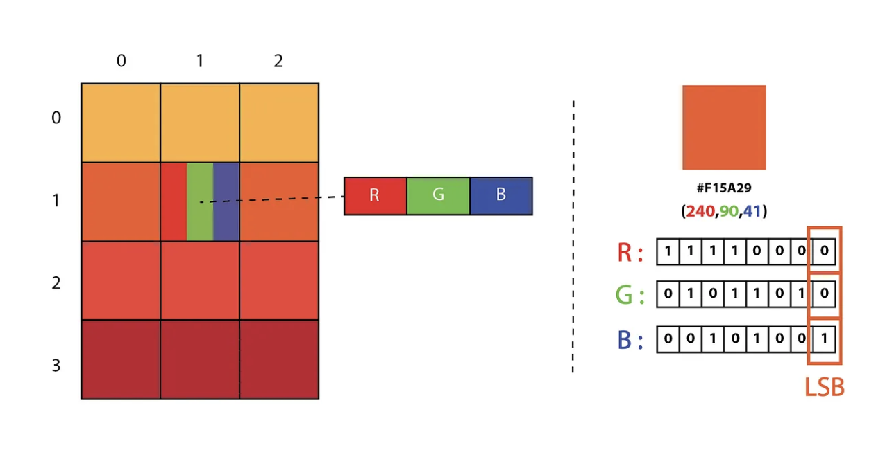

## Steganograph in python LSB and DCT 
### Description

Steganography it is to embeded data inside multimedia with a very geniune manner so that no one can access this data such us photo, video, gif

LSB stands for Least-Significant-Bit is a type of Steganography where we insert our data into non significant bits in the multimedia.

##### encode text

You provide a string and the program hides it
We will implement decoding version

##### encode image

You provide an image and the method iterates for every pixel in order to hide them. A good practice is to have a carrier 8 times bigger than the image to hide (so that each pixel will be put only in the first bit).
We will implement decoding version

##### encode binary

You provide a binary file to hide; This method can obfuscate any kind of file.
We will implement decoding version

### implementation in Python

With an image + (text/image/binary). We must generate a key + signature.
A key + signature will be sent to destination in order to perform decoding tasks.

### Bibliography

https://medium.com/swlh/lsb-image-steganography-using-python-2bbbee2c69a2

### How to run the code
Once you have cloned the git repository in your workspace open the main.py file and at the end of the file you will see : 
if __name__ == '__main__':
    test_pdf()
This means if you execute the main function it will call the test_pdf which will encode a PDF file into an image. You can find the image succesfully encoded in outputs.

If you want to execute the part that encodes an image in an image you have to run test_code_img() in place of test_pdf()
It will hide the image in the image.
If you want to retrieve the image you hided you have to execute test_decode_img().

To test encoding and decoding a text in the image using LSB or DCT, you can directly execute the interface.

### appliquer dct et et lsb sur l'interface graphique 

taper les commandes suivantes  :

cd dct_and_GUI 
source venv/bin/activate

# install python3 or python 

python3 gui.py